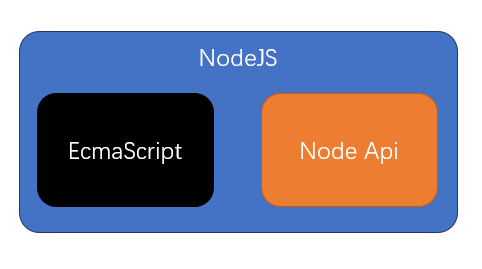

# Node 概述

## 什么是Node

官网：https://nodejs.org/en/  民间中文网：http://nodejs.cn/

> Node是一个JS的运行环境

## 浏览器中的JS & Node中的JS

### 浏览器中的JS

1. Web Api 提供了操作浏览器窗口和页面的能力
   1. BOM
   2. DOM
   3. AJAX
2. 浏览器仅提供了有限的能力，导致JS只能做有限的操作
   1. 跨域问题
   2. 文件读写问题

### Node中的JS

1. Node Api 几乎提供了所有能做的事
2. Node提供了完整的控制计算机的能力，NodeJS几乎可以通过Node提供的接口，实现对整个操作系统的控制

## 我们通常用Node干什么

### 开发桌面应用程序

### 开发服务器应用程序

**微型站点**

1. 这种结构通常应用在微型的站点上
2. Node服务器要完成请求的处理、响应、和数据库交互、各种业务逻辑

**各类站点**

1. 这种结构非常常见，应用在各种规模的站点上
2. Node服务器不做任何与业务逻辑有关的事情。绝大部分时候，只是简单的转发请求。但可能会有一些额外的功能
   1. 简单的信息记录
      1. 请求日志
      2. 用户偏好
      3. 广告信息
   2. 静态资源托管
   3. 缓存

## 前置知识

1. 网络通信
2. ES6
3. 模块化
4. 包管理器

