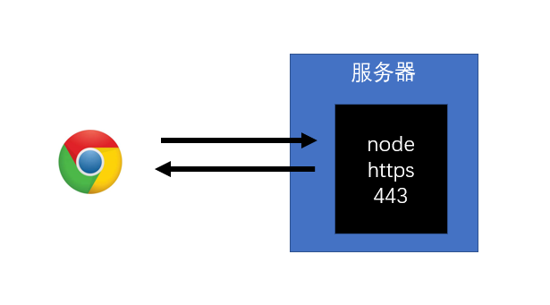
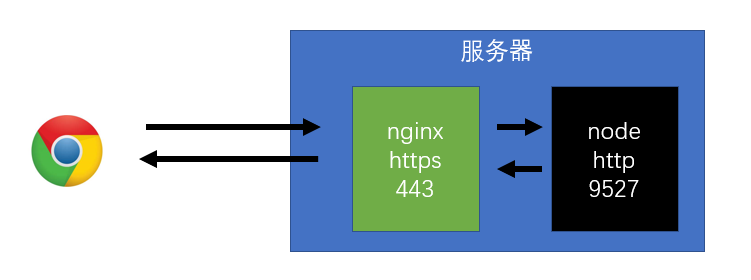

# 搭建 https 服务

## 服务器结构

**类型一**



**类型二**



## 证书准备

### 网上购买权威机构证书

阿里云 SSL

1. 准备好money
2. 准备好服务器
3. 准备好域名
4. 该方式应用在部署环境中

### 本地产生证书

> 自己作为权威机构发布证书

**具体步骤：**

1. 安装openssl（通过输入命令openssl测试）

   1. [下载源码，自行构建](https://github.com/openssl/openssl)
   2. [下载windows安装包](https://slproweb.com/products/Win32OpenSSL.html)
   3. mac下自带

2. 生成CA私钥

   1. ```sh
      openssl genrsa -des3 -out ca-pri-key.pem 1024
      # genrsa：密钥对生成算法
      # -des3：使用对称加密算法des3对私钥进一步加密(命令运行过程中会让用户输入密码，该密码将作为des3算法的key)
      # -out ca-pri-key.pem：将加密后的私钥保存到当前目录的ca-pri-key.pem文件中 (pem：Privacy-Enhanced Mail (PEM) )
      # 1024：私钥的字节数
      ```

3. 生成CA公钥（证书请求）

   1. ```sh
      openssl req -new -key ca-pri-key.pem -out ca-pub-key.pem
      # 通过私钥文件ca-pri-key.pem中的内容，生成对应的公钥，保存到ca-pub-key.pem中
      ```

   2. 运行过程中要使用之前输入的密码来实现对私钥文件的解密

   3. 其他输入信息

      1. Country Name：国家名  CN
      2. Province Name：省份名 Sichuan
      3. Local Name：城市名
      4. Company Name：公司名
      5. Unit Name：部门名
      6. Common Name：站点名
      7. …

4. 生成CA证书

   1. ```sh
      openssl x509 -req -in ca-pub-key.pem -signkey ca-pri-key.pem -out ca-cert.crt
      # 使用X.509证书标准，通过证书请求文件ca-pub-key.pem生成证书，并使用私钥ca-pri-key.pem加密，然后把证书保存到ca-cert.crt文件中
      ```

5. 生成服务器私钥 

   1. ```sh
      openssl genrsa -out server-key.pem 1024

6. 生成服务器公钥

   1. ```sh
      openssl req -new -key server-key.pem -out server-scr.pem
      ```

7. 生成服务器证书

   1. ```sh
      openssl x509 -req -CA ca-cert.crt -CAkey ca-pri-key.pem -CAcreateserial -in server-scr.pem -out server-cert.crt

## https 模块

