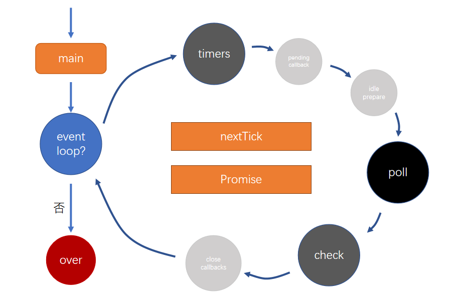

# node 生命周期



**timers**

> 存放计时器的回调函数

**poll**

> 轮询队列

除了timers、checks，绝大部分回调都会放入该队列。比如：文件的读取、监听用户请求。

运作方式：

1. 如果poll中有回调，依次执行回调，直到清空队列
2. 如果poll中没有回调
   1. 等待其他队列中出现回调，结束该阶段，进入下一阶段
   2. 如果其他队列也没有回调，持续等待，直到出现回调为止

**check** 

> 检查阶段

使用setImmediate的回调会直接进入这个队列

==事件循环中，每次打算执行一个回调之前，必须要先清空nextTick和promise队列，同时nextTick队列的优先级高于promise队列需要优先清空==


**面试题1**

```js
// 此类情况 与运行代码时计算机的卡顿状态相关 1
setTimeout(() => console.log(1), 0);
setImmediate(() => console.log(2));
```

**面试题2**

```js
const fs = require("fs");
fs.readFile("./index.js", () => {
  setTimeout(() => console.log(1), 0);
  setImmediate(() => console.log(2));
});
```

**面试题3**

```js
async function async1() {
  console.log("async1 start");
  await async2();
  console.log("async1 end");
}
async function async2() {
  console.log("async2");
}
console.log("script start");
setTimeout(function() {
  console.log("setTimeout0");
}, 0);
setTimeout(function() {
  console.log("setTimeout3");
}, 3);
setImmediate(() => console.log("setImmediate"));
process.nextTick(() => console.log("nextTick"));
async1();
new Promise(function(resolve) {
  console.log("promise1");
  resolve();
  console.log("promise2");
}).then(function() {
  console.log("promise3");
});
console.log("script end");
```

