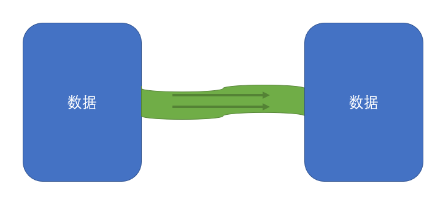
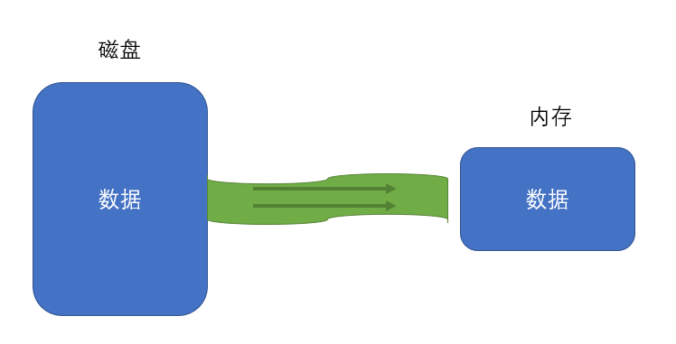
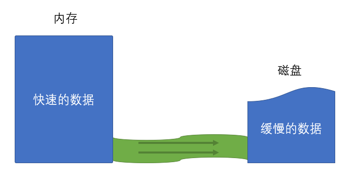
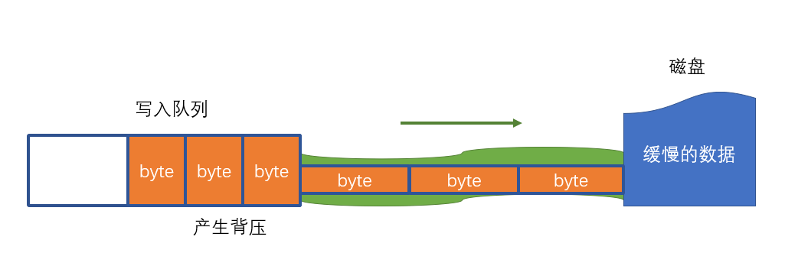

# 流

## 什么是流

> 流是指数据的流动，数据从一个地方缓缓的流动到另一个地方

## 流的分类

流是有方向的

| 类型             | 含义                                       |
| ---------------- | ------------------------------------------ |
| 可读流: Readable | 数据从源头流向内存                         |
| 可写流: Writable | 数据从内存流向源头                         |
| 双工流：Duplex   | 数据即可从源头流向内存，又可从内存流向源头 |

## 为什么需要流

1. 其他介质和内存的数据规模不一致
2. 其他介质和内存的数据处理能力不一致

## 文件流

### 什么是文件流

> 内存数据和磁盘文件数据之间的流动

### 文件流的创建

#### fs.createReadStream(path[, options])

> 含义：创建一个文件可读流，用于读取文件内容

- path：读取的文件路径
- options：可选配置
  - encoding：编码方式
  - start：起始字节
  - end：结束字节
  - highWaterMark：每次读取数量
    - 如果encoding有值，该数量表示一个字符数
    - 如果encoding为null，该数量表示字节数

返回：Readable的子类ReadStream(==rs==)

rs相关方法：

1. 事件：rs.on(事件名, 处理函数)

   1. open

      1. 文件打开事件
      2. 文件被打开后触发
   2. error

      1. 发生错误时触发
   3. close

      1. 文件被关闭后触发
      2. 可通过rs.close手动关闭
      3. 或文件读取完成后自动关闭(autoClose配置项默认为true)
   4. data

      1. 读取到一部分数据后触发
      2. 注册data事件后，才会真正开始读取
      3. 每次读取highWaterMark指定的数量
      4. 回调函数中会附带读取到的数据

         1. 若指定了编码，则读取到的数据会自动按照编码转换为字符串
         2. 若没有指定编码，读取到的数据是Buffer
   5. end
      1. 所有数据读取完毕后触发

2. rs.pause()：暂停读取， 会触发pause事件

3. rs.resume()：恢复读取，会触发resume事件

#### fs.createWriteStream(path[, options])

> 创建一个写入流

- path：写入的文件路径
- options
  - flags：操作文件的方式
    - w：覆盖
    - a：追加
    - 其他
  - encoding：编码方式
  - start：起始字节
  - highWaterMark：每次最多写入的字节数

返回：Writable的字类WriteStream（==ws==）

1. ws.on(事件名, 处理函数)
   1. open
   2. error
   3. close
2. ws.write(data)：写入一组数据
   1. data可以是字符串或Buffer
   2. 返回一个boolean值
      1. true：写入通道没有被填满，接下来的数据可以直接写入，无须排队
      2. false：写入通道目前已被填满，接下来的数据将进入写入队列（要特别注意背压问题，因为写入队列是内存中的数据，是有限的）
   3. 当写入队列清空时，会触发drain事件
3. ws.end([data])
   1. 结束写入，将自动关闭文件
      1. 是否自动关闭取决于autoClose配置
      2. 默认为true
   2. data是可选的，表示关闭前的最后一次写入

#### rs.pipe(ws)

1. 将可读流连接到可写流
2. 返回参数的值
3. 该方法可解决背压问题

