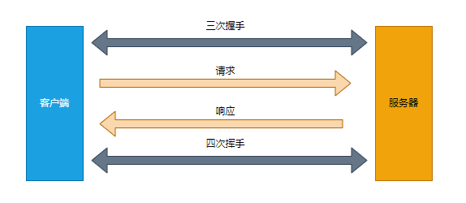
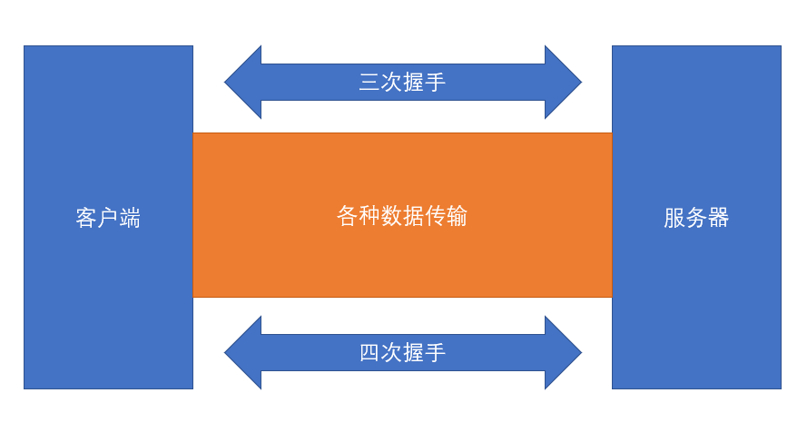
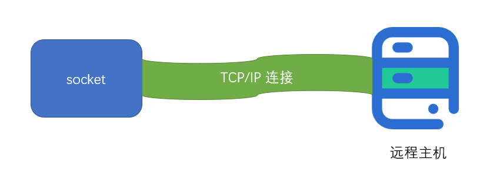
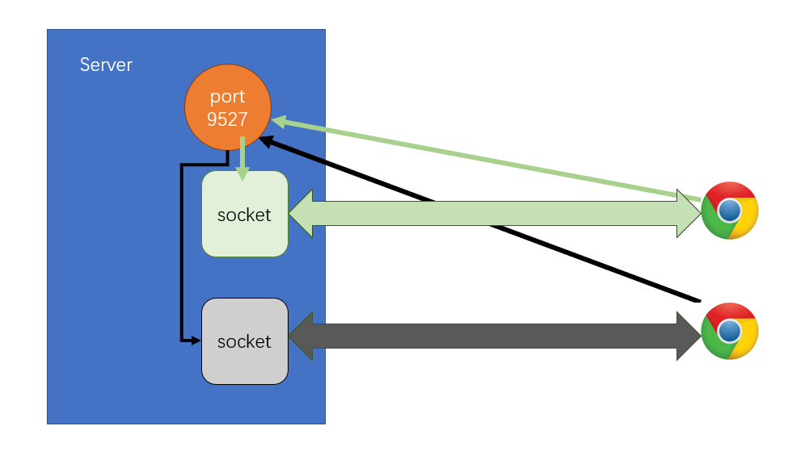

# net 模块

## 回顾 http 请求

**普通模式**

**长连接模式**

## net 模块能干什么

> net是一个通信模块

利用它，可以实现：

1. 进程间的通信 IPC
2. 网络通信 TCP/IP

### 创建客户端

**net.createConnection(options[, connectListener])**

返回：socket

- socket是一个特殊的文件
- 在node中表现为一个双工流对象
- 通过向流写入内容发送数据
- 通过监听流的内容获取数据

### 创建服务器

**net.createServer()**

返回：server对象

- server.listen(port)：监听当前计算机中某个端口
- server.on("listening", ()=>{})：开始监听端口后触发的事件
- server.on("connection", socket=>{})
  - 当某个连接到来时，触发该事件
  - 事件的监听函数会获得一个socket对象

