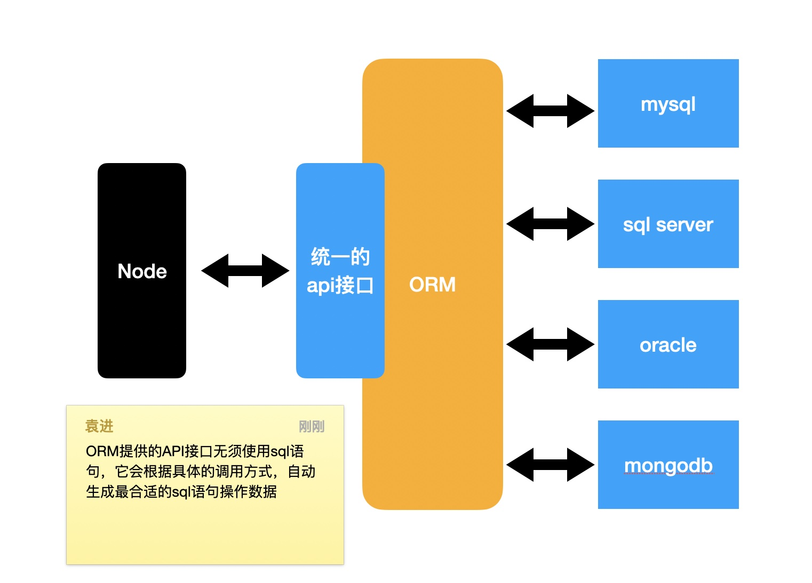

# Sequelize简介

## ORM

> Object Relational Mapping 对象关系映射
> 通过ORM框架，可以自动的把程序中的对象和数据库关联

ORM框架会隐藏具体的数据库底层细节，让开发者使用同样的数据操作接口，完成对不同数据库的操作

**ORM的优势：**

1. 开发者不用关心数据库，仅需关心对象
2. 可轻易的完成数据库的移植
3. 无须拼接复杂的sql语句即可完成精确查询

## Node中的ORM

**[Sequelize（成熟）](https://github.com/demopark/sequelize-docs-Zh-CN)**：支持JS、TS 

**TypeORM（不成熟）**：支持TS